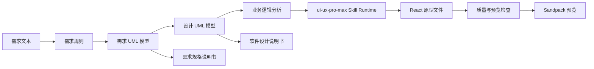

<p align="center">
  <a href="./README.md">
    
  </a>
</p>

<p align="center">
  <strong>简体中文</strong>
</p>

<div align="center">

# 软件工程实验平台

<p align="center">
  <b>
    AI 辅助 UML 建模与前端原型生成工作台
    <br />
    从需求规则、UML 模型到 React 原型和说明书导出
    <br />
    PlantUML 渲染 × 生成追踪 × ui-ux-pro-max Skill Runtime
  </b>
</p>

<p align="center">
  
  
  
</p>

> 一套面向软件工程课程、实验和原型验证的 AI 工作台：把需求、规则、UML、设计模型、前端原型、质量检查和说明书统一沉淀为可追踪产物。

</div>

---

# 🌟 项目简介

软件工程实验平台以“需求到设计再到代码”的实验链路为核心，帮助用户从自然语言需求生成结构化需求规则、需求阶段 UML、设计阶段 UML、可运行 React 原型和 Word 说明书。

它不是一次性模型调用器，而是强调阶段化、可追溯和可修复的实验工作台：

- ✅ **需求阶段建模**
  从需求文本抽取需求规则，并生成用例图、类图、活动图、部署图等结构化模型。
- ✅ **设计阶段建模**
  基于需求模型继续生成顺序图、设计类图、设计活动图、部署图和表关系图。
- ✅ **PlantUML 本地渲染**
  将结构化模型转换为 PlantUML 源码，通过本地渲染服务输出 SVG 预览和 DOCX 可嵌入 PNG。
- ✅ **生成追踪与修复记录**
  记录模型原始返回、解析错误、修复返回、PlantUML 源码、渲染错误和修复后源码，方便定位第一次失败原因。
- ✅ **代码页 Agent 生成**
  当前链路为 `businessLogic + ui-ux-pro-max Skill Runtime + React 原型`：平台先抽取业务逻辑，再由 skill runtime 读取设计知识和 React 栈建议，生成可预览前端原型。
- ✅ **说明书导出**
  支持导出《需求规格说明书》和《软件设计说明书》，保留章节层级、图注、缺图提示和通用封面格式。

---

# 📦 主要能力

- **需求规则与 UML 模型**
  支持需求规则抽取、模型结构化校验、PlantUML 生成、SVG 渲染和错误修复。
- **设计模型链路**
  顺序图作为设计阶段动态行为基础，下游设计图从需求模型和顺序图共同推导。
- **代码原型生成**
  使用业务逻辑 function calling 抽取实体、角色、流程、权限、状态和异常分支，再由 `ui-ux-pro-max` 作为前端设计执行器生成 React + TypeScript + CSS 原型。
- **Skill Runtime**
  扫描本地 skill，读取 `SKILL.md`、资源清单和声明式 action，向代码生成 prompt 注入 design-system、react-stack、ux-guidelines 等上下文。
- **质量与预览检查**
  对生成文件、入口、依赖、业务覆盖、渲染结构和预览可用性进行检查，并把诊断回传给修复阶段。
- **文档生成**
  用 `docx` 生成 Word 文档，UML 图以 PNG 插入，缺失图会在正文中留下明确提示。

---

# 🧩 当前链路



代码生成阶段不会把权限边界、服务边界、过滤条件或函数名当作用户页面文案直接展示；这些说明性内容应进入开发说明文档或注释，页面只呈现真实业务流程、数据、操作和状态反馈。

---

# 🔰 安装与启动

## 1. 进入项目根目录

```powershell
cd umlExperimentalPlatform
```

后续命令默认在仓库根目录执行。

## 2. 安装基础环境

本地至少需要：

- Node.js 22 或更高版本
- npm 10 或更高版本
- Java/JRE 21 或可运行当前 PlantUML jar 的版本

检查方式：

```powershell
node -v
npm -v
java -version
```

项目内置 PlantUML jar：

```text
plantuml/build/libs/plantuml-1.2026.3beta8.jar
```

## 3. 安装依赖

```powershell
npm install
```

本仓库使用 npm workspaces，`apps/*` 和 `packages/*` 的依赖会在根目录统一安装。

## 4. 启动本地服务

推荐一键启动：

```powershell
npm run dev
```

该命令会同时启动：

- Render Service: `http://127.0.0.1:4002`
- API: `http://127.0.0.1:4101`
- Web: Vite 输出地址，通常为 `http://127.0.0.1:5173`

也可以单独启动：

```powershell
npm run dev:render
npm run dev:api
npm run dev:web
```

## 5. 配置模型服务

打开 Web 后进入设置面板，至少填写：

- `API Base URL`：例如 `https://ai.comfly.org`
- `API Key`：模型服务密钥
- 默认文本模型：用于需求、设计、代码和文档生成

平台会自动拼接 OpenAI 兼容接口路径，通常不需要在设置里填写完整 `/v1/chat/completions`。

---

# 🗂️ 项目结构

```text
umlExperimentalPlatform/
├── apps/
│   ├── api/             # Fastify API、SSE、生成编排、文档输出、Skill Runtime
│   ├── render-service/  # PlantUML SVG/PNG 本地渲染服务
│   └── web/             # Vite + React 前端工作台
├── packages/
│   ├── contracts/       # 前后端共享 Zod schema 和类型
│   ├── prompts/         # 需求、设计、代码、文档 prompt
│   └── harness-eval/    # 评测与回归辅助
├── docs/                # 文档、部署说明、说明书模板
└── plantuml/            # 本地 PlantUML 运行依赖
```

---

# 🏗️ 当前技术栈

- **前端**：Vite、React、TypeScript、Tailwind CSS、Radix UI、Sonner、Sandpack
- **后端**：Fastify、TypeScript、Zod、OpenAI 兼容 Chat Completions
- **UML 渲染**：PlantUML、本地 SVG/PNG 渲染服务
- **代码生成**：业务逻辑抽取、通用 Skill Runtime、`ui-ux-pro-max`、React 原型文件操作协议
- **文档**：docx、PNG 图像嵌入、说明书结构化渲染
- **Monorepo**：npm workspaces

---

# ✅ 常用命令

```powershell
# 一键启动本地开发服务
npm run dev

# 构建共享契约与 prompt
npm run build:contracts
npm run build:prompts

# 构建 API / Render / Web
npm run build:api
npm run build:render
npm run build:web

# 测试
npm run test:contracts
npm run test --workspace @uml-platform/prompts
npm run test:api
npm run test:web

# Web 类型检查
npm run typecheck:web
```

---

# 🚀 部署提示

- 前端构建产物位于 `apps/web/dist`。
- API 默认生产端口可按环境变量配置，本地安全开发端口为 `4101`。
- Render Service 默认端口为 `4002`，依赖 PlantUML jar 和 Java 运行环境。
- 生产环境建议配置 CORS 白名单：

```env
API_CORS_ORIGINS=https://your-domain.example.com
RENDER_SERVICE_CORS_ORIGINS=https://your-domain.example.com
```

- 部署后可访问 API 版本接口检查运行目录、release 信息和 schema 能力。
- 宝塔/PM2 部署可参考 [docs/deployment/baota-cicd.md](docs/deployment/baota-cicd.md)。

---

# 📚 文档入口

- [API 说明](./apps/api/README.md)
- [部署文档](./docs/deployment/baota-cicd.md)
- [OpenAI 兼容 Chat Completions 说明](./docs/contracts/chat-completions.md)
- [说明书模板目录](./docs/template)

---

# 📜 许可证

请以仓库中的 LICENSE 文件或项目实际授权说明为准。

---

# 🤝 反馈

欢迎继续围绕需求建模、设计追踪、Skill Runtime、代码原型质量和说明书格式提出改进建议。
