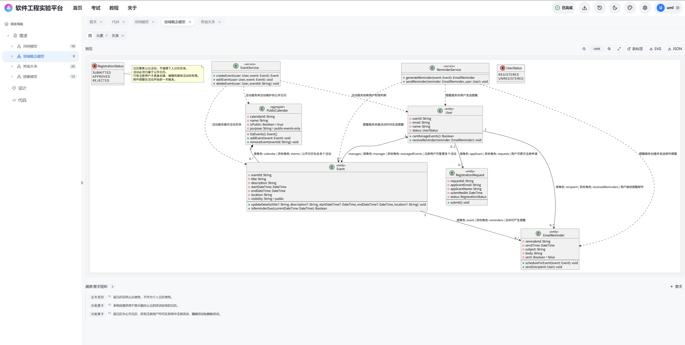
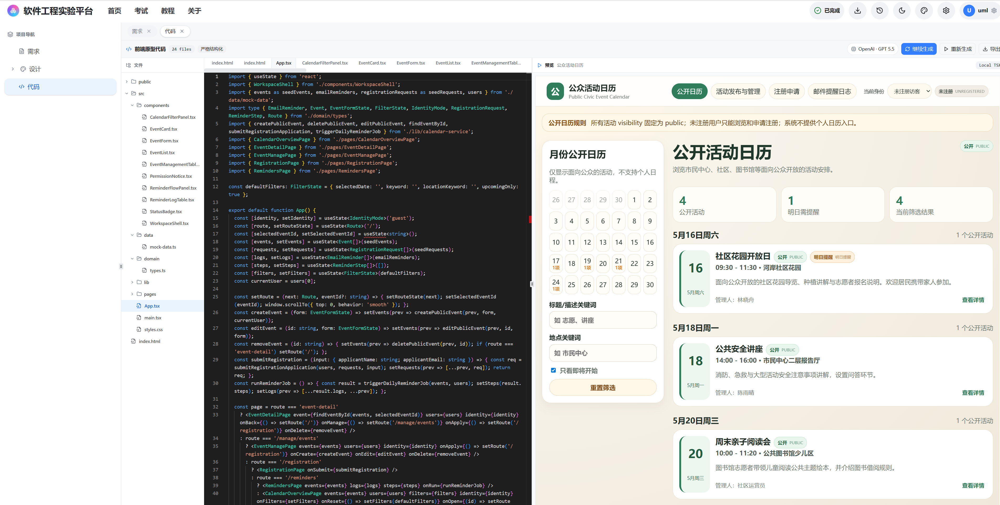
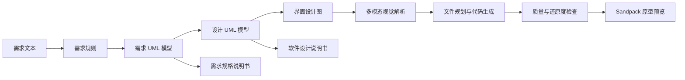

# 软件工程实验平台

软件工程实验平台是一个面向软件工程课程、实验和原型验证的 AI 辅助建模系统。平台从自然语言需求出发，逐步生成需求规则、UML 需求模型、软件设计模型、PlantUML 图像、前端可运行原型以及说明书文档，帮助用户把“需求到设计再到代码”的过程沉淀为可追踪产物。




## 目前支持的功能

- 需求分析：输入需求文本后，生成结构化需求规则，并按用例图、类图、活动图、部署图生成需求阶段模型。
- 设计建模：基于需求模型继续生成顺序图、设计类图、设计活动图、部署图和表关系图。
- 图像渲染：将结构化 UML 模型转换为 PlantUML 源码，并通过本地渲染服务输出网页预览图。
- 代码原型：根据需求、规则和设计模型生成 React + TypeScript + Tailwind 的 Sandpack 前端原型。
- 多模态按图生成：代码生成链路会先生成界面设计图，再通过多模态 `/v1/chat/completions` 解析设计图，约束后续文件规划、代码实现和还原度检查。
- 后台任务：需求、设计、代码和说明书生成都通过统一任务入口展示阶段、进度、执行详情、成功或失败通知。
- 说明书导出：根据需求产物导出《需求规格说明书》，根据设计产物导出《软件设计说明书》，文档内 UML 图以 PNG 嵌入以兼容 Word/WPS。
- 历史快照：保存生成完成后的模型、图像、代码文件、质量检查和说明书记录，支持回看与导出。

## 生成链路



## 技术栈

- Monorepo：npm workspaces
- Web：React、TypeScript、Vite、Tailwind CSS、Radix UI、Sonner、Sandpack
- API：Fastify、TypeScript、Zod、OpenAI 兼容 `/v1/chat/completions`
- Render Service：PlantUML 本地渲染，支持 SVG 网页预览和 PNG 文档嵌入
- 文档：docx 生成 Word 文档

## 环境要求

- Node.js 22 或更高版本
- npm 10 或更高版本
- Java/JRE 21 或可运行当前 PlantUML jar 的版本
- 项目内置 `plantuml/build/libs/plantuml-1.2026.3beta8.jar`
- 可访问的 OpenAI 兼容模型服务，文本和多模态图片消息均走 `/v1/chat/completions`

## 目录结构

```text
apps/
  api/             # 生成任务 API、SSE 事件、文档生成、代码生成编排
  render-service/  # PlantUML SVG/PNG 渲染服务
  web/             # 前端工作台
packages/
  contracts/       # 前后端共享 schema 和类型
  prompts/         # 需求、设计、代码、文档生成 prompt
docs/
  assets/          # README 截图等文档资产
  deployment/      # 部署说明
  template/        # 说明书模板
plantuml/          # 本地 PlantUML 运行依赖
```

## 快速开始

1. 安装依赖：

```powershell
npm install
```

2. 一键启动本地服务：

```powershell
npm run dev
```

该命令会同时启动：

- `render-service`: `http://127.0.0.1:4002`
- `api`: `http://127.0.0.1:4101`
- `web`: Vite 输出的本地地址，默认会指向 `http://127.0.0.1:4101`

3. 打开终端里显示的 Web 地址，在设置面板填写模型服务地址、API Key、文本模型和图片模型。

也可以单独启动各服务：

```powershell
npm run dev:render
npm run dev:api
npm run dev:web
```

## 端口说明

| 服务 | 本地默认端口 | 说明 |
| --- | --- | --- |
| Web | `5173` 起，按 Vite 实际输出为准 | 前端工作台 |
| API | `4101` | 本地安全开发端口，由 `npm run dev` 注入 |
| API 生产 | `4001` | PM2/部署环境默认监听 `127.0.0.1` |
| Render Service | `4002` | PlantUML SVG/PNG 渲染服务，默认监听 `127.0.0.1` |

## 模型配置

前端设置面板中需要填写：

- `API Base URL`：只填写模型服务根地址，例如 `https://your-model-provider.example.com`
- `API Key`：模型服务密钥
- 默认文本模型：用于需求、设计、代码、文档正文生成
- 图片模型：用于代码生成前的界面设计图生成

平台会自动拼接 `/v1/chat/completions`，不需要在设置里手动填写 `/v1` 或完整接口路径。当前多模态链路使用 OpenAI 兼容消息格式：

```json
{
  "role": "user",
  "content": [
    { "type": "text", "text": "请分析这张界面设计图" },
    { "type": "image_url", "image_url": { "url": "https://example.com/ui.png" } }
  ]
}
```

API Key 当前保存在浏览器本地存储中。公开部署或多人使用时，请避免在共享浏览器中保存个人密钥；如需统一托管密钥，建议后续改为后端代理配置。

## 常用校验

```powershell
npm run build:contracts
npm run build:prompts
npm run build:api
npm run build:render
npm run typecheck:web
npm run lint:web
npm run test:contracts
npm run test --workspace @uml-platform/prompts
npm run test:api
npm run test:web
npm run build:web
```

## 部署提示

- 前端构建产物位于 `apps/web/dist`。
- API 服务需要配置模型服务 Base URL、Key、默认模型和渲染服务地址。
- 渲染服务依赖 `plantuml/build/libs/plantuml-1.2026.3beta8.jar`。
- 生产环境建议配置 CORS 白名单：
  - `API_CORS_ORIGINS=https://your-domain.example.com`
  - `RENDER_SERVICE_CORS_ORIGINS=https://your-domain.example.com`
- 部署后可访问 `http://127.0.0.1:4001/api/version` 检查实际运行目录、release 信息和关键 schema 能力。
- 宝塔/PM2 部署可参考 [docs/deployment/baota-cicd.md](docs/deployment/baota-cicd.md)。

## 上传前检查

- 不要提交 `.env`、API Key、私钥、token、日志文件、导出的说明书或临时截图。
- `.gitignore` 已忽略常见日志、构建产物、缓存、临时文件和完整 PlantUML 源码树。
- README 截图位于 `docs/assets/screenshots/`，用于展示公开演示界面；上传前仍建议确认截图中没有私人账号、密钥或真实业务隐私。
- `docs/template/` 中的说明书模板会参与文档生成功能，上传前请确认模板本身不含单位内部修订记录或敏感作者信息。
