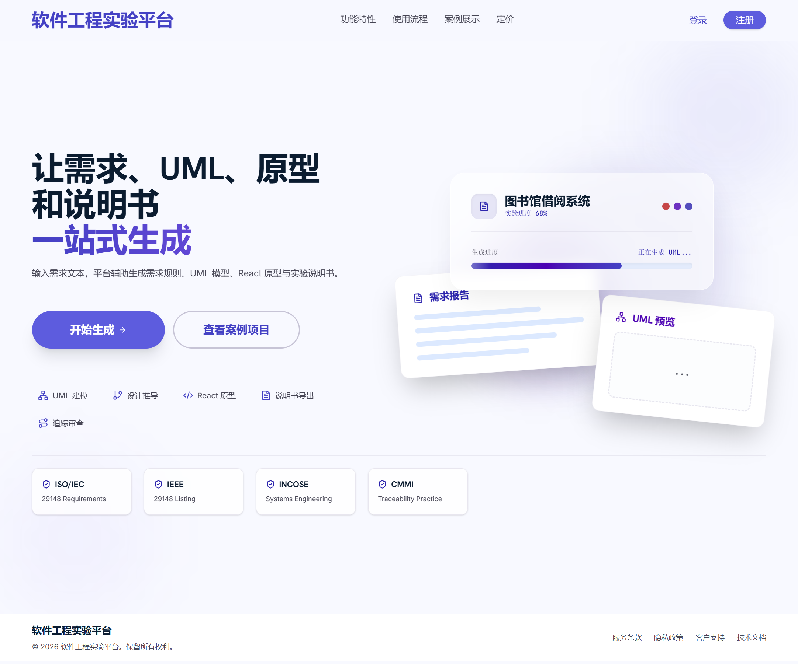
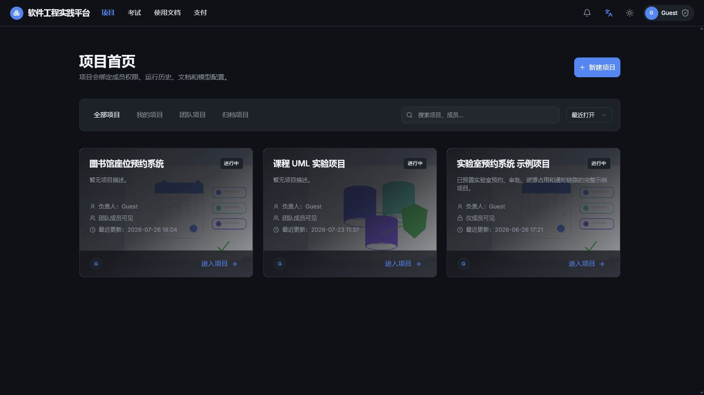
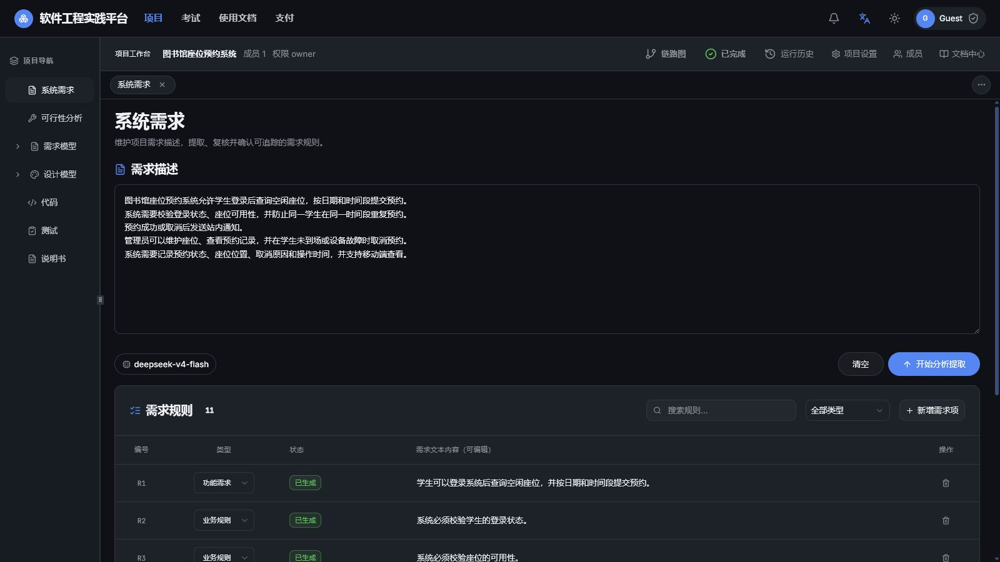
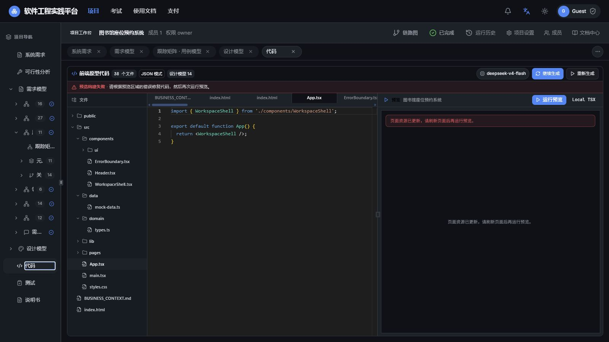
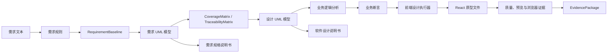

<p align="center">
  <a href="./README.md">
    
  </a>
</p>

<p align="center">
  <strong>简体中文</strong>
</p>

<div align="center">

# 软件工程实验平台

<p align="center">
  <b>
    AI 辅助 UML 建模、可信追踪与前端原型生成工作台
    <br />
    从需求基线、UML 模型到 React 原型、证据包和说明书导出
    <br />
    PlantUML 渲染 × 可信链路 × 通用 Skill Runtime
  </b>
</p>

<p align="center">
  
  
  
</p>

> 一套面向软件工程课程、实验和原型验证的 AI 工作台：把需求、规则、UML、设计模型、前端原型、质量检查、可信证据和说明书统一沉淀为可追踪产物。

</div>

---

# 🖼️ 项目截图

## 官网首页



## 项目首页



## 需求分析工作台



## 前端原型代码与预览



---

# 🌟 项目简介

软件工程实验平台以“需求到设计再到代码”的实验链路为核心，帮助用户从自然语言需求生成结构化需求基线、需求阶段 UML、设计阶段 UML、可运行 React 原型、可信证据包和 Word 说明书。

它不是一次性模型调用器，而是强调阶段化、可追溯和可修复的实验工作台：

- ✅ **需求阶段建模**
  从需求文本抽取需求规则，并生成用例图、类图、活动图、部署图、需求分析模型等结构化模型；缺失上游产物时可经用户确认后串联补齐。
- ✅ **可信需求基线**
  将抽取出的规则沉淀为 `RequirementBaseline`，保留来源片段、原子需求、参与者、动作、对象、条件、验收准则和质量诊断，作为下游生成的共同依据。
- ✅ **设计阶段建模**
  基于需求模型继续生成用例实现设计、设计类图、设计活动图、部署图和表关系图，并区分需求分析顺序图与设计阶段对象调用顺序图。
- ✅ **PlantUML 本地渲染**
  将结构化模型转换为 PlantUML 源码，通过本地渲染服务输出 SVG 预览和 DOCX 可嵌入 PNG。
- ✅ **覆盖矩阵与追踪矩阵**
  生成 `CoverageMatrix` 和 `TraceabilityMatrix`，追踪每条已接受需求在需求模型、设计模型、代码断言、测试与证据中的覆盖状态。
- ✅ **生成追踪、修复与证据包**
  记录模型原始返回、解析错误、修复返回、PlantUML 源码、渲染错误、业务断言、浏览器证据和人工复核项，形成 `EvidencePackage` 便于审阅。
- ✅ **托管模型配置与系统通知**
  支持后台托管和用户私有 Provider 配置、Base URL 安全校验、密钥 AES-GCM 加密存储、项目/用户侧默认模型选择，以及系统公告时间轴和已阅状态；生成任务只引用 `providerConfigId + model`。
- ✅ **代码页 Agent 生成**
  当前链路为 `businessLogic + 通用 Skill Runtime + React 原型`：平台先抽取业务逻辑，再由前端设计执行器读取设计知识和 React 栈建议，生成可预览前端原型。
- ✅ **支付与生成权益**
  PC Web 支持 `/pricing` 和 `/account/billing` 购买入口，后端统一管理 SKU、订单、权益账本和生成任务权益预占/确认/释放。
- ✅ **任务中心与流式诊断**
  生成任务持久化 provider、model、事件和产物状态；跨进程 SSE 会转发 worker 事件，模型无可见增量时显示持续心跳提示，避免页面看起来假排队。
- ✅ **说明书导出**
  支持导出《需求规格说明书》和《软件设计说明书》，保留章节层级、图注、缺图提示和通用封面格式。

---

# 📦 主要能力

- **需求规则与 UML 模型**
  支持需求规则抽取、模型结构化校验、PlantUML 生成、SVG 渲染和错误修复。
- **设计模型链路**
  用例实现设计作为设计阶段动态行为基础，下游设计图从需求模型和用例实现设计共同推导；确定性追踪补齐不制造待确认噪音，低置信兜底才进入复核。
- **可信链路门禁**
  需求、设计、代码和文档阶段都会携带需求基线、覆盖矩阵、追踪矩阵和证据包；阻塞、冲突、低置信度、待确认追踪关系和不可建模需求会进入复核流程。
- **代码原型生成**
  使用业务逻辑 function calling 抽取实体、角色、流程、权限、状态和异常分支，再由前端设计执行器生成 React + TypeScript + CSS 原型。
- **业务断言**
  对生成代码进行需求关联的静态业务断言检查，覆盖权限、角色、状态机、数据一致性、边界条件、异常反馈和幂等等关键业务类别。
- **Skill Runtime**
  扫描本地 skill，读取 `SKILL.md`、资源清单和声明式 action，向代码生成 prompt 注入 design-system、react-stack、ux-guidelines 等上下文。
- **质量与预览检查**
  对生成文件、入口、依赖、业务覆盖、渲染结构和预览可用性进行检查，并把诊断回传给修复阶段；模型持续空白输出会先发送“供应商暂未返回可见流式内容”心跳，超过任务超时配置后终止，避免生成任务长时间挂起。
- **支付与权益**
  支持微信 Native 扫码支付、支付宝电脑网站支付、邮箱验证后新用户赠送次数、无权益购买提示和订单历史；价格、次数和有效期以后端 SKU 为准，支付金额使用整数分并在回调中验签、校验订单与金额、保证幂等发放。
- **文档生成**
  用 `docx` 生成 Word 文档，UML 图以 PNG 插入，缺失图会在正文中留下明确提示。

---

# 🧩 当前链路


```mermaid
flowchart LR
  A["需求文本"] --> B["需求规则"]
  B --> C["RequirementBaseline"]
  C --> D["需求 UML 模型"]
  D --> E["CoverageMatrix / TraceabilityMatrix"]
  E --> F["设计 UML 模型"]
  F --> G["业务逻辑分析"]
  G --> H["业务断言"]
  H --> I["前端设计执行器"]
  I --> J["React 原型文件"]
  J --> K["质量、预览与浏览器证据"]
  K --> L["EvidencePackage"]
  D --> M["需求规格说明书"]
  F --> N["软件设计说明书"]
```

代码生成阶段不会把权限边界、服务边界、过滤条件或函数名当作用户页面文案直接展示；这些说明性内容应进入开发说明文档或注释，页面只呈现真实业务流程、数据、操作和状态反馈。

## 可信链路边界

当前链路可以作为普通业务系统、课程实验、原型验证和非安全关键项目的“可审计可信生成”基础：它能把自然语言需求约束为需求基线，要求每条已接受需求进入覆盖矩阵和追踪矩阵，并把低置信度、自动补齐、不可建模、冲突和失败证据显式交给人工复核。

它不承诺对任意自然语言、强监管行业、安全关键系统或完全无人工复核的场景给出自动正确结果。代码业务断言属于需求关联的静态证据，浏览器验收目前覆盖可信证据页和代表性生成流程；上线到更高要求场景前，应补充领域专家复核、真实运行验收、合规审计和针对具体项目的测试证据。

---

# 🔰 安装与启动

## 1. 进入项目根目录

```powershell
cd umlExperimentalPlatform
```

后续命令默认在仓库根目录执行。

## 2. 安装基础环境

本地至少需要：

- Node.js 22 或更高版本
- npm 10 或更高版本
- Java/JRE 21 或可运行当前 PlantUML jar 的版本
- Graphviz（PlantUML 渲染类图等图形时需要 `dot` 命令）

检查方式：

```powershell
node -v
npm -v
java -version
dot -V
```

项目内置 PlantUML jar：

```text
plantuml/build/libs/plantuml-1.2026.3beta8.jar
```

## 3. 安装依赖

```powershell
npm install
```

本仓库使用 npm workspaces，`apps/*` 和 `packages/*` 的依赖会在根目录统一安装。

## 4. 启动本地服务

推荐一键启动：

```powershell
npm run dev
```

该命令会先检查并启动本地 OnlyOffice Document Server Docker 容器，然后同时启动：

- OnlyOffice Document Server: `http://127.0.0.1:8080`
- Render Service: `http://127.0.0.1:4002`
- API: `http://127.0.0.1:4101`
- Web: Vite 输出地址，通常为 `http://127.0.0.1:5173`

OnlyOffice 本地容器名为 `onlyoffice-documentserver`，开发 JWT 密钥固定为
`local-onlyoffice-jwt-secret`。API 会自动使用
`PUBLIC_API_BASE_URL=http://host.docker.internal:4101`，让 Docker 容器能够回连宿主机 API。

本地检查：

```powershell
curl http://127.0.0.1:8080/healthcheck
curl http://127.0.0.1:4101/api/version
```

`/api/version` 中的 `features.onlyOfficeDocumentServerConfigured` 应为 `true`。
如果提示找不到 Docker CLI，请安装 Docker Desktop，或把
`C:\Program Files\Docker\Docker\resources\bin` 加入 PATH 后重新打开 PowerShell。
如果 Docker 命令存在但 daemon 不可用，请启动 Docker Desktop 并等待它就绪。
如果提示 8080 端口被占用，请释放端口后重试。如果已有
`onlyoffice-documentserver` 容器使用了不同 `JWT_SECRET`，按终端提示删除并重建该本地开发容器。

也可以单独启动：

```powershell
npm run dev:render
npm run dev:api
npm run dev:web
```

## 5. 配置模型服务

模型服务推荐使用后端托管 Provider 配置：管理员配置系统/项目 Provider，普通用户可在个人设置中新增用户私有 Provider。创建时会先执行 HTTPS、公网地址、无凭据 URL、默认安全端口和模型发现/healthcheck 校验；通过后 API Key 才会以 AES-GCM 密文、hash 和 key tail 形式保存，接口只返回 masked key。

Provider 使用范围由后端强制校验：

- `system` Provider 可供有项目生成权限的登录用户使用。
- `project` Provider 只能在对应项目的 run 中使用。
- `user` Provider 只能由 `scopeId` 对应的本人使用，其他用户即使猜到 `providerConfigId` 也会被当作不可用处理。

项目生成时浏览器只提交 `providerConfigId` 和 `model`，后台解析 Base URL 与密钥，并把本次 run 的 `providerConfigId`、供应商名称、scope 和 model 写入运行记录与 admin 任务中心。Admin 可以看到用户私有 Provider 的归属用户、状态、模型目录、风险状态和 masked key，但不会看到明文 Key，也不能测试连接、获取模型列表、轮换密钥或重新启用用户私有 Provider；只允许做禁用/吊销等治理动作。

本地开发仍可打开 Web 设置面板使用 legacy 明文配置，至少填写：

- `API Base URL`：例如 `https://your_provider_baseurl`
- `API Key`：模型服务密钥
- 默认文本模型：用于需求、设计、代码和文档生成

平台会自动拼接 OpenAI 兼容接口路径，通常不需要填写完整 `/v1/chat/completions`。生产部署必须关闭 legacy 明文配置入口，并在 `UML_PROVIDER_BASE_URL_ALLOWLIST` 中配置允许的系统/项目供应商域名；用户自建 Provider 仍会经过后端公网与重定向安全校验。

---

# 🗂️ 项目结构

```text
umlExperimentalPlatform/
├── apps/
│   ├── api/             # Fastify API、SSE、生成编排、支付权益、文档输出、Skill Runtime
│   ├── render-service/  # PlantUML SVG/PNG 本地渲染服务
│   └── web/             # Vite + React 前端工作台
├── packages/
│   ├── contracts/       # 前后端共享 Zod schema 和类型
│   ├── prompts/         # 需求、设计、代码、文档 prompt
│   ├── harness-e2e/     # 浏览器级可信链路验收与代表性生成流程检查
│   └── harness-eval/    # 评测与回归辅助
├── docs/                # 文档、部署说明、可信链路审计、说明书模板
└── plantuml/            # 本地 PlantUML 运行依赖
```

上传前建议把本地运行痕迹留在 `.gitignore` 中，不随源码提交：

- `.codex-artifacts/`、`.codex-e2e-logs/`、`.codex-run-logs/`、`.codex-test-logs/`、`.codex-*.png`、`.codex-*.log`：Codex/浏览器验收截图和日志。
- `.local-*.log`：本地 API、Web、Render、Postgres 调试日志。
- `screenshots/`、`tmp-*.png`、`current-page*.png`：本地视觉验证截图。
- `apps/api/.local-documents/`：本地说明书工作区，可能包含 DOCX、metadata 和 workspace secret。
- `apps/api/data/`、根目录 `data/`：本地数据库、说明书和运行数据目录，生产环境应使用外部持久化目录或数据库。

可信链路核心实现位于：

- `apps/api/src/runs/baselines/`：需求基线构建与下游门禁。
- `apps/api/src/runs/traceability/`：覆盖矩阵、追踪矩阵和可信链路诊断。
- `apps/api/src/runs/evidence/`：证据包组装、复核项和下游证据门禁。
- `apps/api/src/runs/pipelines/code/code-business-assertions.ts`：代码阶段业务断言。
- `apps/web/src/features/trusted-chain/`：前端可信证据查看、复核和导出。
- `docs/trusted-chain-audit/`：行业可接受性审计、风险边界、实施路线和最终结论。

支付与权益核心实现位于：

- `apps/api/src/routes/billing/`：支付、权益和后台账单 API 路由注册。
- `apps/api/src/billing/`：SKU、订单、权益账本、补偿、退款标记和生成权益预占逻辑。
- `apps/api/src/adapters/payments/`：微信、支付宝和本地 mock/sandbox 支付适配器。
- `apps/web/src/features/user-platform/`：前台定价页、账户账单页、支付确认弹窗、微信二维码弹窗和支付宝中间态。

Provider 与公告核心实现位于：

- `apps/api/src/routes/provider-configs/`：用户侧托管 Provider 配置 API。
- `apps/api/src/provider-configs/`：Provider 配置加密、白名单、默认模型和持久化。
- `apps/api/src/runs/providers/`：生成任务 Provider scope 校验、限流、用量记录和 run 快照追踪。
- `apps/api/src/routes/admin/`：Admin Provider 元数据展示、用户私有 Provider 治理限制、任务中心 provider 字段输出。
- `apps/web/src/features/system-notices/`：系统公告时间轴、未读状态和已阅交互。

生成任务与线上维护辅助：

- `apps/api/src/runs/queue/`：BullMQ run 队列、跨进程 worker 事件发布和 SSE 桥接。
- `apps/api/src/sse/`：运行事件 SSE、历史事件回放、Redis 订阅失败后的前端轮询兜底。
- `scripts/maintenance/delete-test-accounts.mjs`：线上测试账号清理工具，默认 dry-run 并回滚；真正硬删除必须先备份数据库，再使用 dry-run JSON 作为 `--confirm-targets-file` 并显式传入 `--execute --backup-confirmed`。

---

# 🏗️ 当前技术栈

- **前端**：Vite、React、TypeScript、Tailwind CSS、Radix UI、Sonner、Sandpack
- **后端**：Fastify、TypeScript、Zod、OpenAI 兼容 Chat Completions
- **UML 渲染**：PlantUML、本地 SVG/PNG 渲染服务
- **代码生成**：业务逻辑抽取、通用 Skill Runtime、前端设计执行器、React 原型文件操作协议
- **支付**：微信 Native、支付宝电脑网站支付、后端 SKU、权益账本、支付回调验签与幂等处理
- **文档**：docx、PNG 图像嵌入、说明书结构化渲染
- **Monorepo**：npm workspaces

---

# ✅ 常用命令

```powershell
# 一键启动本地开发服务
npm run dev

# 构建共享契约与 prompt
npm run build:contracts
npm run build:prompts

# 构建 API / Render / Web
npm run build:api
npm run build:render
npm run build:web

# 测试
npm run test:contracts
npm run test --workspace @uml-platform/prompts
npm run test:api
npm run test:web
npm run test:harness-e2e

# Web 类型检查
npm run typecheck:web

# 线上测试账号清理 dry-run（只读事务并回滚）
$env:DATABASE_URL = "postgres://..."
node scripts/maintenance/delete-test-accounts.mjs --output cleanup-dry-run.json

# 可信链路关键回归
npx tsx --test apps/api/src/runs/baselines/requirement-baseline.test.ts
npx tsx --test apps/api/src/runs/traceability/trusted-chain-traceability.test.ts
npx tsx --test apps/api/src/runs/pipelines/code/code-business-assertions.test.ts
npx tsx --test apps/api/src/runs/evidence/evidence-package.test.ts
npx tsx --test apps/api/src/runs/trusted-chain-regression.test.ts
```

---

# 🚀 部署提示

- 前端构建产物位于 `apps/web/dist`。
- API 默认生产端口可按环境变量配置，本地安全开发端口为 `4101`。
- Render Service 默认端口为 `4002`，依赖 PlantUML jar 和 Java 运行环境。
- 真实用户、项目、run、文档、后台管理和供应商配置上线前，必须核对
  [生产环境变量清单](./docs/deployment/production-env.md)：包括
  `DATABASE_URL`、`SMTP_*`、`UML_PROVIDER_SECRET_KEY`、CORS、OnlyOffice、
  主 Web/API base、后台前端/API base、session cookie SameSite/Secure、管理员
  bootstrap，以及 legacy fallback 开关。
- PC Web 支付上线前必须显式配置 `UML_BILLING_SKUS_JSON`、微信支付商户参数和支付宝应用参数；生产环境缺少正式支付配置时，创建订单会返回配置错误，不会降级为本地 mock 支付。
- 用户私有 Provider 属于用户敏感数据。生产排查时只能看 masked key、hash/tail、归属范围、风险和审计事件；禁止在日志、toast、审计 metadata 或 admin 页面输出明文 API Key。
- 清理线上测试账号必须先执行 `scripts/maintenance/delete-test-accounts.mjs --output cleanup-dry-run.json` 保存候选清单，完成数据库备份并人工确认后，才允许使用 `--execute --backup-confirmed --confirm-targets-file cleanup-dry-run.json`。脚本匹配 `email`、`username` 或 `display_name` 以 `Load Use` / `codex` 开头的账号，并删除其拥有项目、user-scope Provider、密钥、会话、run、文档、用量、账单和审计/风险关联数据。
- 后台不提供生产固定默认账号密码。首次上线用
  `npm run bootstrap:admin --workspace @uml-platform/api` 创建一次性真实
  `super_admin`，创建后关闭 `UML_ENABLE_ADMIN_BOOTSTRAP`，再完成邮箱验证和
  TOTP MFA。
- 生产环境建议配置 CORS 白名单：

```env
API_CORS_ORIGINS=https://your-domain.example.com
RENDER_SERVICE_CORS_ORIGINS=https://your-domain.example.com
```

- 说明书在线编辑依赖 OnlyOffice Document Server。HTTP 站点可使用 HTTP
  OnlyOffice 地址，例如 `ONLYOFFICE_DOCUMENT_SERVER_URL=http://office.example.com`
  和 `PUBLIC_API_BASE_URL=http://platform.example.com`；公网真实数据建议升级 HTTPS。
- 生产环境建议把说明书目录放到 release 外部：
  `UML_DOCUMENT_STORAGE_DIR=/www/wwwroot/uml-platform/shared/documents`。
  平台会按登录后的项目作用域隔离文档，未登录用户不能访问说明书工作区。
- 部署后可访问 API 版本接口检查运行目录、release 信息和 schema 能力。
- 宝塔/PM2 部署可参考 [docs/deployment/baota-cicd.md](docs/deployment/baota-cicd.md)。
- 后台真实数据 Wave 4 验收可参考
  [docs/acceptance/wave-4-real-data-acceptance.md](./docs/acceptance/wave-4-real-data-acceptance.md)。

---

# 📚 文档入口

- [API 说明](./apps/api/README.md)
- [部署文档](./docs/deployment/baota-cicd.md)
- [生产环境变量清单](./docs/deployment/production-env.md)
- [支付与权益实施方案](./docs/implementation/payment-entitlement-implementation-plan.md)
- [可信链路审计工作台](./docs/trusted-chain-audit/README.md)
- [可信链路最终结论](./docs/trusted-chain-audit/09-final-conclusion.md)
- [可信链路测试与证据计划](./docs/trusted-chain-audit/08-test-and-evidence-plan.md)
- [Wave 4 真实数据验收清单](./docs/acceptance/wave-4-real-data-acceptance.md)
- [浏览器验收 Harness](./packages/harness-e2e/README.md)
- [OpenAI 兼容 Chat Completions 说明](./docs/contracts/chat-completions.md)
- [说明书模板目录](./docs/template)

---

# 📜 许可证

请以仓库中的 LICENSE 文件或项目实际授权说明为准。

---

# 🤝 反馈

欢迎继续围绕需求建模、设计追踪、Skill Runtime、代码原型质量和说明书格式提出改进建议。
