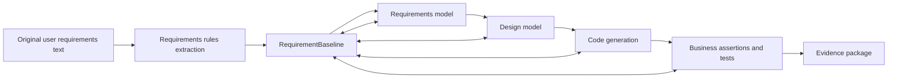
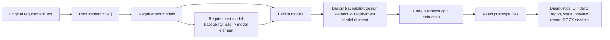

# Current Chain Map

This document maps the chain that must be audited. It now records the source-backed current implementation found during the 2026-05-24 code review.

## Chain Under Audit

## Artifact Responsibilities

| Artifact | Expected responsibility | Current implementation evidence | Gaps |
|---|---|---|---|
| Original requirements text | Preserve the user's wording and source fragments. | Run request and snapshots preserve `requirementText`; Phase 1 `AtomicRequirement` entries now carry `sourceFragment` and `sourceLocation`. | Source spans are deterministic text offsets from extracted rules; they are not yet produced by an LLM/source parser with multi-document provenance. |
| Requirements rules | Extract candidate actors, goals, entities, constraints, exceptions, and non-functional requirements. | `RequirementRule` supports broad Chinese categories including functional, data, non-functional, deployment, and exception handling (`packages/contracts/src/index.ts:26-43`). The requirements pipeline extracts rules when missing (`apps/api/src/runs/pipelines/requirements-pipeline.ts:377-405`). | A rule only has `id`, `category`, `text`, and `relatedDiagrams`; it is not an atomic requirement with actor, state, data, constraint, ambiguity, assumption, confidence, criticality, or acceptance criteria. |
| RequirementBaseline | Become the authoritative structured source for all downstream work. | Phase 1 added first-class `RequirementBaseline`, `AtomicRequirement`, `RequirementQualityReport`, `RequirementAssumption`, and `RequirementConflict` contracts; requirement/design/code/document snapshots now carry `requirementBaseline`; requirements, design, and code pipelines assert the baseline gate before downstream generation. Phase 3 improved deterministic actor/object extraction so unseen domain terms such as `仓库主管` and `采购单` do not depend on a fixed actor vocabulary. Phase 7 exposes the baseline in the browser EvidencePackage review page. | Remaining gap: source spans are still derived from extracted rule text rather than multi-document provenance. |
| Coverage matrix | Track every requirement's modelability and downstream coverage status. | Phase 2 added first-class `CoverageMatrix` with statuses `covered`, `partially-covered`, `not-modelable`, `pending-review`, and `conflict`. Requirement, design, and code snapshots now persist the matrix and pipelines emit `coverageMatrix` artifact events. Phase 5 carries unresolved `not-modelable`, `pending-review`, `conflict`, and partial coverage rows into EvidencePackage review items. Phase 7 exposes and exports the first-class matrix in the browser. | Future work can add richer filtering and reviewer-specific views, but the matrix is now browser-reviewable. |
| Requirements model | Represent user goals, actors, domain concepts, and requirement-level workflows. | Requirement models are generated and repaired, with `requirementModelTraceability` linking `ruleId -> model element`; Phase 2 converts that into run-level bidirectional requirement-to-requirements-model links and blocks uncovered accepted requirements, orphan model artifacts, fake rule references, and placeholder/shallow traces. Phase 3 adds semantic model diagnostics that require traced requirement models to explain baseline actor/action/object/condition/outcome terms through business-bearing elements instead of only structural actor/relationship traces. The 2026-05-24 follow-up tightened behavior requirements so object-only word overlap, such as `退款` without the `审批` action, is blocked as `semantic-model-gap`. | The check is deterministic and conservative; it is an audit gate, not a claim of perfect natural-language understanding. If structured slot evidence is missing, the chain must block or require review instead of silently treating it as covered. |
| Design model | Represent implementation-facing components, interactions, classes, states, and service boundaries. | Design traceability maps design source elements to requirement-model targets and supports `mappingSource`, `reviewStatus`, and `confidence`; Phase 2 emits run-level design trace links and blocks orphan/fake design traceability and pending auto-filled design mappings at completion. Phase 3 checks sequence message text and other design source records against resolved baseline requirements, so a sequence diagram that only lists participants cannot satisfy workflow coverage. Phase 5 adds API review decisions and downstream evidence gates, so unresolved review evidence can block the next stage when supplied to design/code/document start routes. Phase 7 proves the same gates are visible in the browser EvidencePackage review page. | Future work can add deeper design-specific review screens, but minimum gate visibility is implemented. |
| Code generation | Generate behavior that implements traced requirements and business rules. | Code runs analyze `businessLogic` from `requirementText`, `rules`, design models, and PlantUML. Phase 2 creates code trace links from accepted requirements to generated code artifacts, using direct business terms or the root `/BUSINESS_CONTEXT.md` bundle manifest as the trace anchor; unanchored business code artifacts block completion as orphan code. Phase 4 adds requirement-linked `businessAssertionResults` before completion and feeds passed assertions into the trace matrix as `test` artifacts. Phase 7 adds browser-controlled representative workflow checks. | Static business assertions and representative browser checks are conservative evidence, not a promise that every arbitrary generated app is fully correct. |
| Business assertions | Prove permissions, state transitions, data constraints, boundaries, and exceptions. | Phase 4 adds `CodeBusinessAssertionResult` contracts and deterministic code assertions under `apps/api/src/runs/pipelines/code/code-business-assertions.ts`. Assertions bind to `requirementId`, classify permission/role/state/data/boundary/exception/idempotency/business-behavior checks, ignore `/BUSINESS_CONTEXT.md` as sole proof, and block completion through `business-assertion-gap` diagnostics when critical behavior is missing. Phase 7 verifies representative generated workflow assertions in Chromium and blocks supplied failed/pending browser evidence downstream. | Future hardening should execute browser assertions directly against each generated Sandpack/application bundle. |
| Evidence package | Preserve baseline, traceability, review items, tests, and failure/repair records. | Phase 5 adds first-class `EvidencePackage` contracts, snapshot persistence, pipeline artifact events, API retrieval, and durable review decisions. The package includes baseline, requirement quality report, coverage matrix, traceability matrix, model/code artifact summaries, business assertion results, browser evidence, review items, decisions, failure records, and repair records. Unresolved review items leave the package `blocked`; failed evidence leaves it `failed`; design/code/document start routes reject supplied blocked or failed evidence with HTTP 409. Phase 7 adds frontend review/export and Playwright screenshot/DOM/console/network evidence. | Future work should persist browser artifacts from live generated runs automatically. |

## Current Implemented Chain

The observed implementation is closer to:

Important positive controls:

- Requirement-model traceability can fail when no valid rule-to-element mappings are produced.
- Design-model traceability is checked for missing design source elements.
- The frontend exposes requirement and design element traceability matrices and warns about stale or incomplete mappings.
- Code generation performs deterministic prototype quality checks and an LLM-assisted fidelity review.

Important limitations:

- The chain now produces and gates on a first-class RequirementBaseline and first-class CoverageMatrix/TraceabilityMatrix artifacts for requirement, design, and code runs.
- Coverage is tracked per accepted atomic requirement, and non-functional requirements that cannot be directly modeled are preserved as `not-modelable` with EvidencePackage review items. Alternative evidence can now be recorded as a review decision and reviewed/exported in the browser.
- Traceability supports requirement, requirements-model, design-model, code, test, and evidence artifact types; current pipelines populate requirement/model/design/code links, Phase 4 populates requirement-to-test links for passing business assertions, and Phase 5 packages the matrix for audit/review.
- Pending auto-filled design traceability is now a backend completion gate, and Phase 5 can record API review decisions. Phase 7 adds the dedicated frontend EvidencePackage review/export workflow.
- Browser-controlled acceptance evidence is implemented in `packages/harness-e2e` for evidence visibility/export/review and a representative generated workflow; future work should connect the same browser checks to every live generated app bundle.

## Questions For Code Review

1. Does a single authoritative requirements baseline exist, or do later stages read partial prompts and diagrams directly?
2. Are source text spans preserved for each requirement?
3. Can every model element point back to at least one requirement?
4. Can every generated code behavior point back to at least one requirement?
5. Are non-functional requirements preserved when they cannot be rendered into UML?
6. Are low-confidence or derived assumptions blocked, flagged, or silently accepted?
7. Does code generation create business logic and tests, or only UI and data shells?
8. Does the platform detect traceability forgery, such as IDs copied without semantic coverage?

## Current Evidence Log

| Date | Reviewer | Area | Evidence collected | Notes |
|---|---|---|---|---|
| 2026-05-24 | Codex | Workbench setup | Created audit documents. | Code review not started in this file yet. |
| 2026-05-24 | Codex + parallel explorer agents | Requirement baseline, traceability, code generation, frontend reviewability | Reviewed contracts, API pipelines, traceability normalizers, run snapshots, code generation pipeline, frontend traceability page, workspace session guards, and e2e scaffold. | Current chain has useful local traceability controls but lacks first-class RequirementBaseline, CoverageMatrix, EvidencePackage, code/test traceability, and browser acceptance gates. |
| 2026-05-24 | Codex | Phase 0 revalidation | Re-ran source searches for `RequirementBaseline`, `AtomicRequirement`, `CoverageMatrix`, `TraceabilityMatrix`, and `EvidencePackage`; re-read contracts, traceability normalizer, design/code pipelines, generation task tests, and e2e scaffold. | Findings still match the real code: pending review is surfaced in task summaries and documents, but no authoritative baseline, per-requirement coverage matrix, end-to-end trace matrix, evidence package, business assertion gate, or browser acceptance suite exists yet. |
| 2026-05-24 | Codex | Phase 1 implementation | Added baseline contracts, deterministic baseline builder, snapshot persistence, baseline artifact event, and hard pipeline gate for blocked baseline quality reports. | RequirementBaseline foundation is implemented and verified by contracts/API tests; coverage, bidirectional traceability, evidence package, and browser acceptance remain future phases. |
| 2026-05-24 | Codex | Phase 2 implementation | Added CoverageMatrix/TraceabilityMatrix contracts, run-level trusted-chain builder, requirement/design/code pipeline gates, artifact events, and orphan/uncovered/fake/shallow trace tests. | Requirement/model/design/code traceability is implemented and verified by contracts/API tests; business assertions, evidence packages, frontend review UI, and browser acceptance remain future phases. |
| 2026-05-24 | Codex | Phase 3 implementation | Added semantic model diagnostics for requirement and design model traceability, sequence workflow explanation checks, non-functional `not-modelable` alternate-evidence review rows, and domain-generic baseline actor/object extraction. | Model quality gates are implemented and verified by targeted traceability tests plus full API/contract/build checks; evidence-package, business assertion, frontend review, and browser acceptance phases remain open. |
| 2026-05-24 | Codex | Phase 3 semantic gate follow-up | Revalidated the concern that RequirementBaseline coverage must not be simple word matching. Added a regression where `管理员必须审批退款` is traced to `查看退款记录`; the model shares actor/object words but lacks the required action. | The targeted traceability test failed before the fix and passed after action/object slot evidence was required for behavior requirements. |
| 2026-05-24 | Codex | Phase 4 implementation | Added requirement-linked code business assertion contracts, deterministic assertion generation, code pipeline artifact events, traceability `test` links, and completion blocking for failed critical assertions. | Code business assertion gates are implemented and verified by targeted RED/GREEN tests plus full API/contract/build checks; evidence packages, cross-domain suites, review workflow, and browser acceptance remain open. |
| 2026-05-24 | Codex | Phase 5 implementation | Added EvidencePackage contracts, backend package builder, snapshot persistence, pipeline artifact events, project run evidence/review-decision APIs, and downstream start-route gates for blocked/failed supplied evidence. | EvidencePackage and API review workflow are implemented and verified by targeted RED/GREEN tests plus contract/API build checks; frontend review UI, cross-domain suites, and browser acceptance remain open. |
| 2026-05-24 | Codex | Phase 6 implementation | Added backend cross-domain regression for library, e-commerce, appointment scheduling, course selection, dorm repair, inventory purchasing, and permission approval flow, plus negative gate assertions. | Cross-domain and negative backend regression is implemented and verified; frontend/browser acceptance remains open. |
| 2026-05-24 | Codex | Phase 7 implementation | Added frontend EvidencePackage review/export, browser evidence display, failed/pending browser evidence downstream gate, and Playwright acceptance checks with screenshot, DOM, console, network, export, blocked-state, and representative workflow evidence. | Browser reviewability and acceptance are implemented and verified; remaining limitations are future hardening around automatic browser evidence persistence for arbitrary generated app bundles. |
