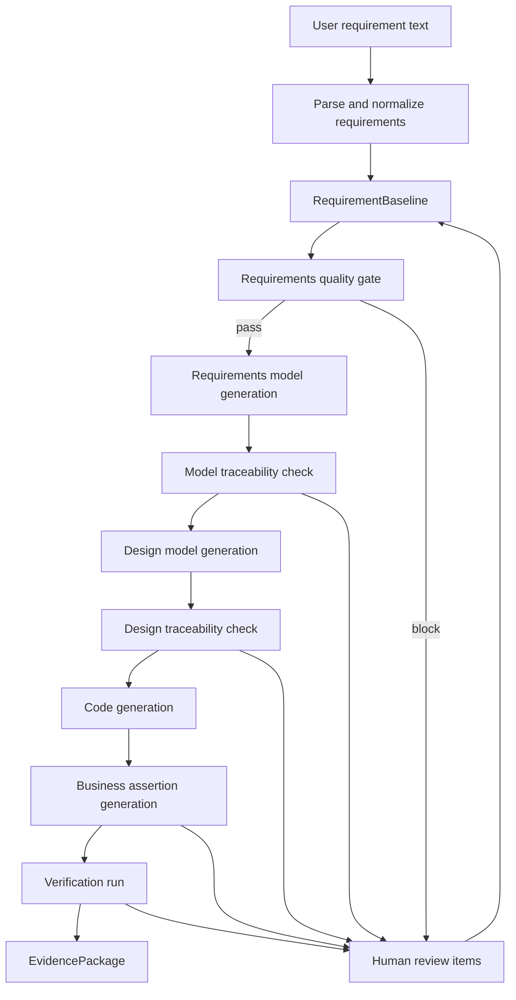

# Target Architecture

This document defines the target architecture for an industry-acceptable trusted chain. It is a design target for audit and roadmap work, not proof that the current system already implements it.

## Architectural Principle

All downstream artifacts must be generated from a shared, source-attributed RequirementBaseline. No stage should rely only on a local prompt, a partial UML diagram, or a previous generated artifact without checking against the baseline.

## Core Artifacts

### RequirementBaseline

The authoritative requirements artifact for a run.

Minimum fields:

```ts
type RequirementBaseline = {
  runId: string;
  sourceDocumentId: string;
  requirements: AtomicRequirement[];
  assumptions: RequirementAssumption[];
  conflicts: RequirementConflict[];
  qualityReport: RequirementQualityReport;
  createdAt: string;
};
```

### AtomicRequirement

Represents one traceable requirement.

```ts
type AtomicRequirement = {
  id: string;
  sourceFragment: string;
  sourceLocation?: {
    startOffset?: number;
    endOffset?: number;
    section?: string;
  };
  type:
    | "functional"
    | "non-functional"
    | "data"
    | "role"
    | "constraint"
    | "exception"
    | "business-rule"
    | "interface"
    | "assumption";
  actor?: string;
  subject?: string;
  action?: string;
  object?: string;
  condition?: string;
  expectedOutcome?: string;
  acceptanceCriteria: string[];
  priority?: "must" | "should" | "could";
  criticality?: "critical" | "high" | "medium" | "low";
  confidence: number;
  status: "accepted" | "ambiguous" | "conflict" | "pending-review" | "rejected" | "derived";
};
```

### CoverageMatrix

Tracks whether each requirement has an accountable downstream path.

```ts
type CoverageStatus =
  | "covered"
  | "partially-covered"
  | "not-modelable"
  | "pending-review"
  | "conflict";

type CoverageMatrixRow = {
  requirementId: string;
  status: CoverageStatus;
  rationale: string;
  modelElements: string[];
  designElements: string[];
  codeArtifacts: string[];
  tests: string[];
  reviewItems: string[];
};
```

### TraceabilityMatrix

Supports both directions of trace.

```ts
type TraceabilityLink = {
  fromArtifactType: "requirement" | "requirements-model" | "design-model" | "code" | "test" | "evidence";
  fromArtifactId: string;
  toArtifactType: "requirement" | "requirements-model" | "design-model" | "code" | "test" | "evidence";
  toArtifactId: string;
  linkType: "satisfies" | "refines" | "implements" | "verifies" | "derives-from" | "blocks";
  confidence: number;
  rationale: string;
};
```

### QualityGate

Blocks downstream generation when critical risk exists.

Example gates:

- No accepted critical requirement may be uncovered.
- No conflict may pass without human decision.
- No generated design element may lack a requirement or approved assumption.
- No generated code path may be marked complete without a business assertion or accepted alternative evidence.
- No low-confidence critical behavior may be silently generated.

### EvidencePackage

The audit output for a generation run.

```ts
type EvidencePackage = {
  runId: string;
  requirementBaselineRef: string;
  coverageMatrixRef: string;
  traceabilityMatrixRef: string;
  qualityGateResultsRef: string;
  modelArtifacts: string[];
  codeArtifacts: string[];
  testResults: string[];
  humanReviewItems: string[];
  repairRecords: string[];
};
```

## Target Flow



## Design Rule

Every generated artifact must answer three questions:

1. Which requirement or approved assumption caused this artifact to exist?
2. What evidence shows this artifact covers that requirement?
3. What happens if the requirement is ambiguous, conflicting, low-confidence, or not modelable?
